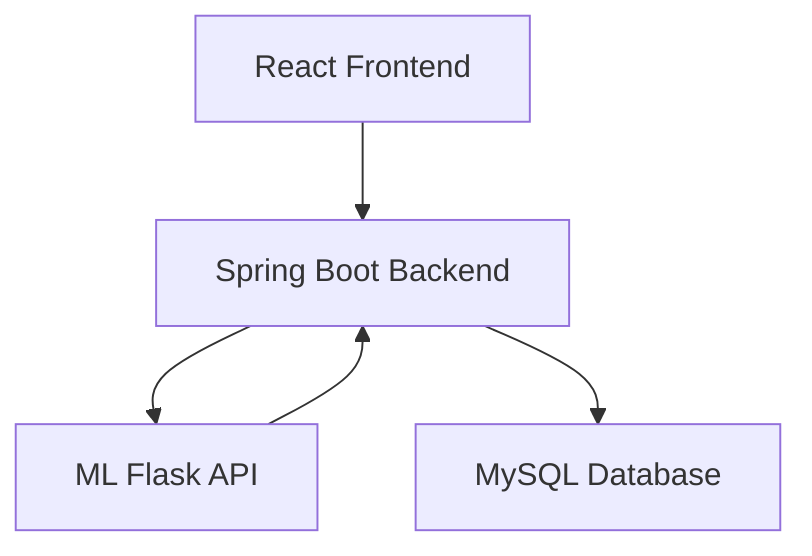
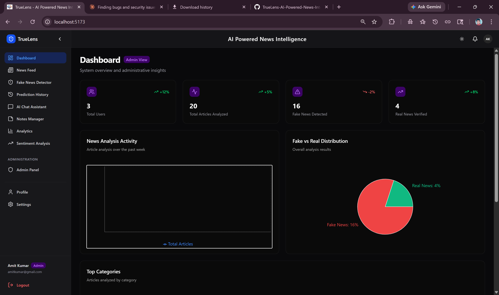
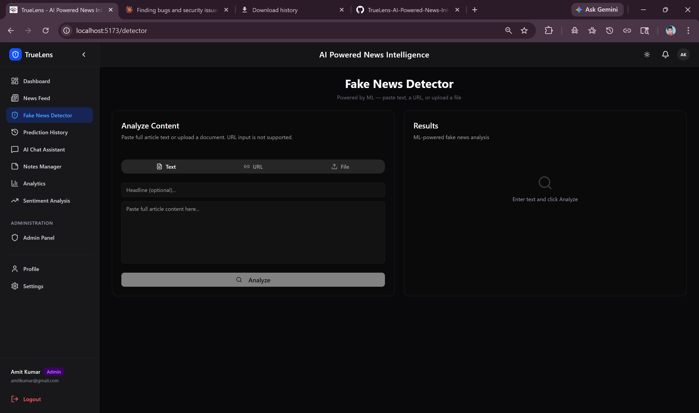
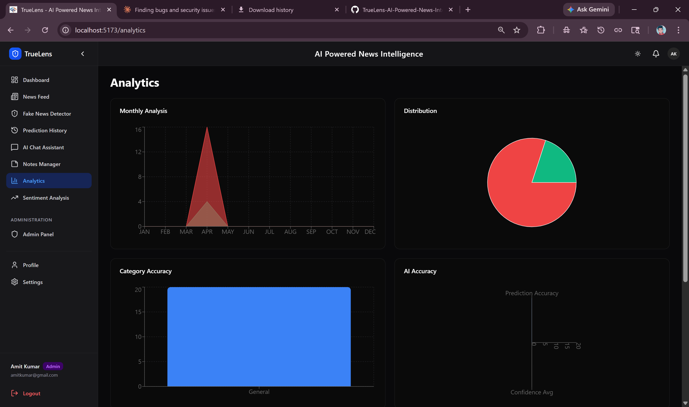
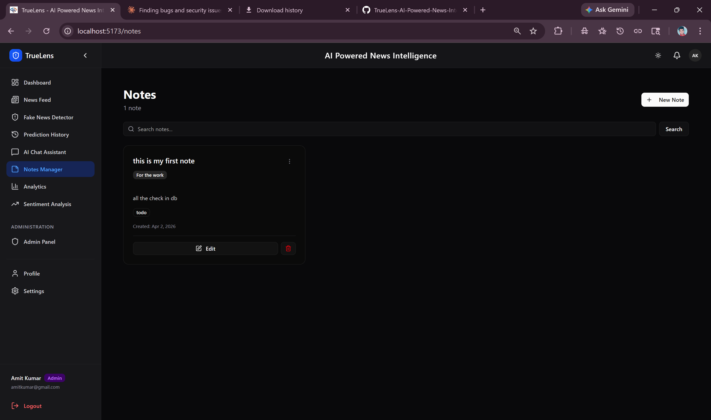

# 🚀 TrueLens – AI Powered News Intelligence Platform

<p align="center">
  <b>Detect Fake News • Analyze Sentiment • AI Insights • Real-time Analytics</b>
</p>

<p align="center">
  
  
  
  
  
</p>

---

## 🧠 Problem Statement

Fake news spreads rapidly across digital platforms, making it difficult for users to verify authenticity and trust information.

---

## 💡 Solution

**TrueLens** uses Machine Learning + Microservices Architecture to:

* Detect fake news instantly
* Provide confidence scores
* Analyze sentiment
* Track analytics & history
* Assist users via AI chatbot

---

## ⚡ Key Highlights (Resume Booster)

* 🔥 Built **full-stack microservices system**
* 🤖 Integrated **ML model (Logistic Regression + TF-IDF)**
* 🔐 Implemented **JWT + Refresh Token Security**
* 📊 Developed **real-time analytics dashboard**
* 🧠 Added **AI Chat Assistant (HuggingFace API)**
* 📦 Designed **scalable REST APIs**

---

## 🏗️ System Architecture



---

## 🔄 Application Flow

```id="flow01"
User Input → Frontend → Backend → ML API → Prediction → Database → UI Response
```

---

## 🛠️ Tech Stack (Detailed)

### 🎨 Frontend

* React (Vite + TypeScript)
* Tailwind CSS
* Context API
* Axios

### ⚙️ Backend

* Spring Boot
* Spring Security
* JWT + Refresh Tokens
* REST Controllers

### 🤖 Machine Learning

* Python (Flask)
* Scikit-learn
* TF-IDF Vectorization
* Logistic Regression

### 🗄️ Database

* MySQL

---

## 📊 Features Breakdown

### 🔐 Authentication

* Login / Register
* Role-based access (Admin/User)
* Token refresh mechanism

### 📰 News Module

* News feed
* Category filtering
* Search functionality

### 🤖 Fake News Detection

* ML-based classification
* Confidence score
* Prediction history

### 📈 Analytics Dashboard

* Charts (Pie / Stats)
* Admin analytics panel
* User insights

### 🧠 AI Features

* Chat assistant
* Sentiment analysis
* Fact checking

### 📝 Notes Module

* Full CRUD
* PDF export

---

## 📂 Folder Structure

```id="struct01"
frontend/
backend/
ml-service/
docs/
```

---

## ⚙️ Environment Variables

### Backend (.env)

```env id="env01"
JWT_SECRET=your_secret
DB_URL=your_db_url
ML_API_URL=http://localhost:5000
```

### Frontend (.env)

```env id="env02"
VITE_API_BASE_URL=http://localhost:8080
```

---

## 📸 Screenshots (IMPORTANT)

> 📌 Add real screenshots here (very important for recruiters)

| Feature   | Screenshot                     |
| --------- | ------------------------------ |
| Dashboard |  |
| Detection |  |
| Analytics |  |
| Notes     |      |

---

## 🚀 Performance / Metrics (Add if possible)

* Model Accuracy: ~90%+
* API Response Time: <500ms
* Secure Auth with JWT

---

## 🌐 Live Demo

* 🔗 Frontend: *Add Link*
* 🔗 Backend API: *Add Link*

---

## 🧪 Testing

* Postman API testing
* End-to-end flow validation
* Error handling implemented

---

## 🔮 Future Enhancements

* BERT-based deep learning model
* Real-time news API (Google News)
* Notification system
* Multi-language support

---

## 👨‍💻 Author

**Avnesh Kumar**

---

## ⭐ Why This Project Stands Out

✔ Full-stack + ML integration
✔ Microservices architecture
✔ Production-ready structure
✔ Real-world problem solving

---

## 💬 For Recruiters

This project demonstrates:

* System design skills
* Backend + frontend integration
* ML deployment knowledge
* Secure authentication handling

---

⭐ If you found this useful, don't forget to star the repo!
