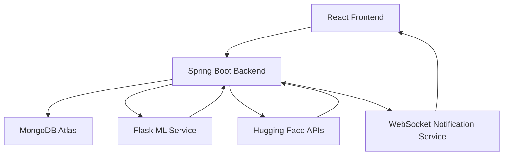

# 🚀 TrueLens — AI-Powered News Intelligence Platform

<p align="center">
  
  
  
  
  
</p>

<p align="center">
  <b>Detect Fake News • Verify Sources • Analyze Sentiment • Generate AI Insights</b>
</p>

<p align="center">
  An enterprise-grade AI-powered platform that combines Machine Learning, Natural Language Processing, Secure Authentication, and Real-Time Analytics to help users identify misinformation and analyze news credibility.
</p>

---

## 🌟 Overview

The rapid spread of misinformation across digital platforms has made it increasingly difficult for users to determine whether news content is trustworthy.

**TrueLens** addresses this challenge by leveraging Machine Learning and AI technologies to provide:

- Fake News Detection
- URL-Based Verification
- Sentiment Analysis
- Fact Checking
- AI-Assisted News Insights
- Analytics & Prediction History
- Secure User Authentication
- Real-Time Notifications

The platform enables users to analyze content from multiple sources including plain text, URLs, PDFs, and DOCX files.

---

# ✨ Key Features

## 🤖 AI-Powered News Intelligence

- Fake News Detection using Machine Learning
- Confidence Score Generation
- News Credibility Analysis
- Multi-Input News Verification
- AI-Powered Fact Checking
- Sentiment Classification
- AI Chat Assistant

---

## 📄 Multi-Input Analysis

Analyze content from:

- Plain Text
- News Articles
- URLs
- PDF Documents
- DOCX Documents

---

## 📊 Analytics Dashboard

Track platform activity through:

- Prediction Statistics
- Detection Trends
- Sentiment Distribution
- User Activity Metrics
- Historical Analysis
- Admin Insights

---

## 🔐 Enterprise-Grade Authentication

- Secure User Registration
- Login Authentication
- JWT Access Tokens
- Refresh Token Rotation
- Role-Based Authorization
- Protected API Routes
- Password Reset Workflow
- Email Verification Support

---

## 👥 Role-Based Access Control

### User

- Analyze News
- View Prediction History
- Manage Personal Notes
- Access AI Assistant

### Admin

- Platform Analytics
- User Management
- Content Monitoring
- System Insights

---

## 🔔 Real-Time Features

- WebSocket Notifications
- Live Updates
- Instant User Alerts
- Event-Based Communication

---

## 📝 Notes Management

Built-in productivity module with:

- Create Notes
- Update Notes
- Delete Notes
- Organize Information
- Store Analysis References

---

## 🛡️ Security Features

- JWT Authentication
- Refresh Tokens
- Spring Security
- API Protection
- Role-Based Access Control
- Request Validation
- Rate Limiting
- Secure Password Handling

---

# 🏗️ System Architecture



---

# 🔄 Application Workflow

```text
User Input
    │
    ▼
React Frontend
    │
    ▼
Spring Boot Backend
    │
    ├──────────────► Authentication & Security
    │
    ├──────────────► MongoDB Atlas
    │
    ├──────────────► Flask ML Service
    │
    └──────────────► Hugging Face AI
                        │
                        ▼
                Prediction Result
                        │
                        ▼
                 Analytics Storage
                        │
                        ▼
                    User Dashboard
```

---

# 🛠️ Tech Stack

## Frontend

| Technology | Purpose |
|------------|----------|
| React | UI Development |
| TypeScript | Type Safety |
| Vite | Build Tool |
| Tailwind CSS | Styling |
| Axios | API Communication |
| Context API | State Management |

---

## Backend

| Technology | Purpose |
|------------|----------|
| Spring Boot 3 | REST API Development |
| Spring Security | Authentication |
| JWT | Authorization |
| WebSocket | Real-Time Communication |
| OpenAPI / Swagger | API Documentation |
| Bucket4j | Rate Limiting |

---

## Machine Learning

| Technology | Purpose |
|------------|----------|
| Flask | ML Service |
| Scikit-Learn | Model Training |
| NLTK | Text Processing |
| TF-IDF | Feature Engineering |
| Logistic Regression | Fake News Classification |

---

## Database

| Technology | Purpose |
|------------|----------|
| MongoDB Atlas | Cloud Database |
| Spring Data MongoDB | Data Access Layer |

---

## Deployment

| Service | Usage |
|----------|--------|
| Vercel | Frontend Hosting |
| Render | Backend Hosting |
| MongoDB Atlas | Database Hosting |

---

# 🤖 AI & Machine Learning Modules

## Fake News Detection

Machine Learning pipeline for classifying news content as:

- Real News
- Fake News

Includes:

- Confidence Scores
- Classification Results
- Historical Tracking

---

## Sentiment Analysis

Determine emotional tone of content:

- Positive
- Neutral
- Negative

Powered by NLP techniques and AI APIs.

---

## Fact Checking

Verify news credibility using:

- Content Analysis
- NLP Processing
- AI-Assisted Verification

---

## AI Chat Assistant

Interactive assistant that helps users:

- Understand predictions
- Interpret sentiment scores
- Get platform guidance
- Explore analysis results

---

# 📂 Project Structure

```bash
TrueLens/
│
├── frontend/
│   ├── src/
│   ├── components/
│   ├── pages/
│   ├── services/
│   └── hooks/
│
├── backend/
│   ├── controllers/
│   ├── services/
│   ├── repositories/
│   ├── security/
│   ├── websocket/
│   └── config/
│
├── ml-service/
│   ├── model/
│   ├── routes/
│   ├── utils/
│   └── app.py
│
├── docs/
│
└── README.md
```

---

# 📡 API Modules

### Authentication APIs

- Register
- Login
- Refresh Token
- Logout
- Forgot Password
- Reset Password

### User APIs

- Profile Management
- History Tracking
- Notes Management

### News Intelligence APIs

- Fake News Detection
- URL Verification
- Sentiment Analysis
- Fact Checking

### Admin APIs

- Analytics
- User Insights
- Platform Monitoring

---

# ⚙️ Environment Variables

## Backend

```env
JWT_SECRET=your_secret_key

MONGODB_URI=your_mongodb_connection_string

ML_API_URL=http://localhost:5000

FRONTEND_URL=http://localhost:5173
```

---

## Frontend

```env
VITE_API_BASE_URL=http://localhost:8080
```

---

## ML Service

```env
MODEL_PATH=model.pkl

VECTORIZER_PATH=tfidf.pkl
```

---

# 🚀 Getting Started

## Clone Repository

```bash
git clone https://github.com/AvneshTech/TrueLens-AI-Powered-News-Intelligence-Platform.git

cd TrueLens-AI-Powered-News-Intelligence-Platform
```

---

## Start Backend

```bash
cd backend

./mvnw spring-boot:run
```

---

## Start Frontend

```bash
cd frontend

npm install

npm run dev
```

---

## Start ML Service

```bash
cd ml-service

pip install -r requirements.txt

python app.py
```

---

# 📸 Screenshots

> Add actual project screenshots here.

| Feature | Preview |
|----------|----------|
| Dashboard | Screenshot |
| Fake News Detection | Screenshot |
| Sentiment Analysis | Screenshot |
| Prediction History | Screenshot |
| Analytics Dashboard | Screenshot |
| Admin Panel | Screenshot |
| AI Chat Assistant | Screenshot |

---

# 📖 API Documentation

Swagger/OpenAPI documentation available after backend startup:

```bash
https://truelens-backend-hdip.onrender.com/swagger-ui.html
```

or

```bash
https://truelens-backend-hdip.onrender.com/swagger-ui/index.html
```

---

# 🧪 Testing

### Backend Testing

- REST API Validation
- Authentication Testing
- Security Testing
- Error Handling

### ML Testing

- Prediction Validation
- Classification Accuracy
- Model Evaluation

### Integration Testing

- Frontend ↔ Backend
- Backend ↔ ML Service
- Backend ↔ MongoDB

---

# 🌐 Live Demo

### Frontend

https://truelens-frontend.vercel.app/auth/login

### Backend

https://truelens-backend-hdip.onrender.com/

---

# 🔮 Future Enhancements

- Advanced Transformer Models
- Multi-Language Analysis
- Real-Time News Aggregation
- News Recommendation Engine
- Explainable AI Predictions
- Enhanced Fact Verification
- Mobile Application

---

# 💼 Resume Highlights

### Key Engineering Achievements

- Built a full-stack AI-powered News Intelligence Platform using React, Spring Boot, Flask, and MongoDB Atlas.
- Implemented JWT Authentication, Refresh Tokens, Role-Based Access Control, and WebSocket Notifications.
- Developed Machine Learning pipelines for fake news detection, sentiment analysis, and content verification.
- Designed scalable REST APIs with OpenAPI documentation and rate-limiting support.
- Integrated AI-powered chat assistance and analytics dashboards for enhanced user experience.

---

# 👨‍💻 Author

### Avnesh Kumar

🔗 GitHub: https://github.com/AvneshTech

🔗 LinkedIn: *www.linkedin.com/in/avnesh-kumar-4b4117286*

---

# ⭐ Support

If you found this project useful:

⭐ Star the repository

🍴 Fork the project

🛠️ Contribute improvements

📢 Share with others

---

<p align="center">
  Built with ❤️ using React, Spring Boot, Flask, MongoDB & Machine Learning
</p>