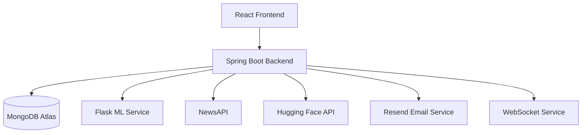

# 🧠 Phase 1 – Planning & System Architecture

<p align="center">
  <b>Defining the architecture, technology stack, and development roadmap for TrueLens</b>
</p>

---

# 🎯 Goal

Design a scalable, secure, and maintainable architecture for an AI-powered News Intelligence Platform capable of handling authentication, machine learning predictions, analytics, and real-time communication.

---

# 📌 Project Vision

TrueLens aims to help users identify misinformation by combining:

- Machine Learning
- Natural Language Processing
- Secure Authentication
- Real-Time Communication
- Analytics & Monitoring

into a single intelligent platform.

---

# ✨ Functional Requirements

## Authentication & Security

- User Registration
- User Login
- JWT Authentication
- Refresh Token Mechanism
- Email Verification
- Password Reset
- Role-Based Access Control

---

## News Intelligence

- Fake News Detection
- URL-Based News Verification
- Sentiment Analysis
- Fact Checking
- Prediction Confidence Scores

---

## User Features

- Prediction History
- Personal Dashboard
- Notes Management
- AI Chat Assistant
- Notification Center

---

## Admin Features

- User Management
- Analytics Dashboard
- Platform Monitoring
- Prediction Insights

---

# 🏗️ High-Level Architecture



---

# 🗄️ Core Database Collections

```text
users

refresh_tokens

verification_tokens

password_reset_tokens

predictions

notes

notifications

chat_history
```

---

# 🔄 Request Flow

```text
User
 │
 ▼
React Frontend
 │
 ▼
Spring Boot API
 │
 ├── Authentication
 ├── MongoDB Storage
 ├── ML Prediction Service
 ├── News Verification
 ├── Sentiment Analysis
 ├── Email Services
 └── WebSocket Notifications
```

---

# 🛠️ Technology Decisions

## Frontend

- React
- TypeScript
- Vite
- Tailwind CSS

## Backend

- Spring Boot 3
- Spring Security
- JWT
- WebSocket

## Machine Learning

- Python
- Flask
- Scikit-Learn
- TF-IDF
- Logistic Regression

## Database

- MongoDB Atlas

## External Services

- NewsAPI
- Hugging Face API
- Resend Email API

---

# 🔐 Security Planning

- JWT Access Tokens
- Refresh Token Rotation
- Password Encryption (BCrypt)
- Protected Endpoints
- Role-Based Authorization
- Secure API Communication

---

# 📈 Non-Functional Requirements

- Scalability
- Maintainability
- Security
- Performance
- Extensibility
- API-First Design

---

# ✅ Phase 1 Deliverables

- System Architecture Defined
- Technology Stack Finalized
- Database Design Prepared
- API Strategy Planned
- Security Model Designed
- Development Roadmap Created

---

**Status:** ✅ Completed