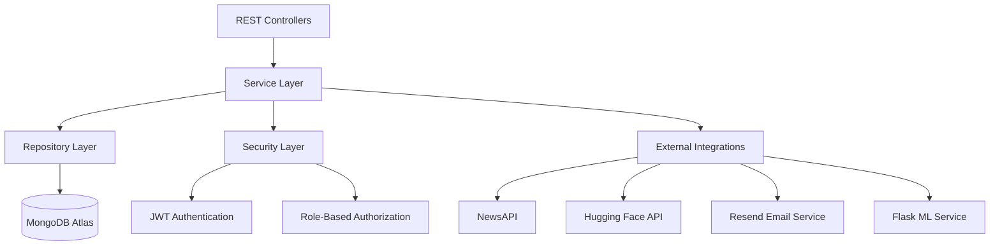

# ⚙️ Phase 2 – Backend Development

<p align="center">
  <b>Building a secure, scalable, and production-ready backend using Spring Boot & MongoDB</b>
</p>

---

# 🎯 Goal

Develop a robust RESTful backend capable of handling authentication, authorization, AI integrations, prediction management, analytics, and real-time communication.

---

# 🏗️ Backend Architecture

The backend follows a layered architecture to ensure maintainability, scalability, and clean separation of concerns.



---

# 🧩 Core Backend Modules

## 🔐 Authentication Module

Implemented secure authentication and authorization workflows.

### Features

- User Registration
- User Login
- JWT Access Tokens
- Refresh Token Rotation
- Logout Support
- Email Verification
- Forgot Password
- Reset Password
- Role-Based Access Control

---

## 👤 User Management Module

### Features

- User Profile Management
- Role Management
- Account Verification
- User Activity Tracking

---

## 🤖 AI Intelligence Module

Responsible for communication with external AI services.

### Features

- Fake News Detection
- URL Verification
- Sentiment Analysis
- Fact Checking
- Confidence Score Generation

### Integrations

- Flask ML Service
- Hugging Face APIs
- NewsAPI

---

## 📊 Analytics Module

Provides insights into platform activity.

### Features

- Prediction Statistics
- Sentiment Distribution
- User Analytics
- Dashboard Metrics
- Historical Trends

---

## 📝 Notes Management Module

Full CRUD operations for personal notes.

### Features

- Create Notes
- Update Notes
- Delete Notes
- Retrieve Notes
- User-Based Access Control

---

## 🔔 Notification Module

Real-time communication layer.

### Features

- WebSocket Notifications
- Event Broadcasting
- Live Updates

---

# 🗄️ Database Design

MongoDB Atlas was selected for flexible document storage and scalability.

## Collections

```text
users

refresh_tokens

verification_tokens

password_reset_tokens

predictions

notes

notifications

chat_history
```

---

# 🔐 Security Architecture

## Authentication Flow

```text
User Login
    │
    ▼
Spring Security
    │
    ▼
JWT Access Token
    │
    ▼
Protected API Access
```

---

## Security Features

- JWT Authentication
- Refresh Tokens
- BCrypt Password Hashing
- Spring Security
- Role-Based Authorization
- Endpoint Protection
- Input Validation
- Exception Handling
- Rate Limiting (Bucket4j)

---

# 🌐 External Service Integrations

## NewsAPI

Used for:

- News Retrieval
- Source Validation
- Content Verification

---

## Hugging Face

Used for:

- Sentiment Analysis
- NLP Processing
- AI-Assisted Insights

---

## Resend

Used for:

- Email Verification
- Password Reset Emails
- User Notifications

---

## Flask ML Service

Used for:

- Fake News Classification
- Confidence Score Prediction
- Content Analysis

---

# 📡 REST API Design

## Authentication APIs

```http
POST /api/auth/register

POST /api/auth/login

POST /api/auth/refresh

POST /api/auth/logout

POST /api/auth/forgot-password

POST /api/auth/reset-password
```

---

## User APIs

```http
GET    /api/users/profile

PUT    /api/users/profile
```

---

## Prediction APIs

```http
POST   /api/predictions/analyze

GET    /api/predictions/history

GET    /api/predictions/{id}
```

---

## Notes APIs

```http
GET    /api/notes

POST   /api/notes

PUT    /api/notes/{id}

DELETE /api/notes/{id}
```

---

## Analytics APIs

```http
GET /api/analytics/dashboard

GET /api/analytics/admin
```

---

# 📖 API Documentation

Swagger/OpenAPI documentation integrated.

```text
http://localhost:8080/swagger-ui/index.html
```

---

# ⚡ Performance Optimizations

- DTO-Based API Responses
- MongoDB Indexing
- Stateless JWT Authentication
- Efficient Query Design
- Rate Limiting
- Centralized Exception Handling

---

# 🧪 Testing Strategy

## Backend Testing

- Authentication Testing
- Authorization Testing
- API Validation
- Security Testing
- Error Handling Validation

## Integration Testing

- MongoDB Connectivity
- ML Service Integration
- Email Service Integration
- WebSocket Communication

---

# ✅ Phase 2 Deliverables

- Spring Boot Backend Implemented
- MongoDB Integration Completed
- JWT Authentication Added
- Role-Based Security Configured
- AI Service Integrations Connected
- REST APIs Developed
- Swagger Documentation Added
- WebSocket Support Implemented

---

## 📊 Phase Status

**Status:** ✅ Completed

**Technology Stack:** Spring Boot • Spring Security • MongoDB Atlas • JWT • WebSocket • OpenAPI • Flask ML Service