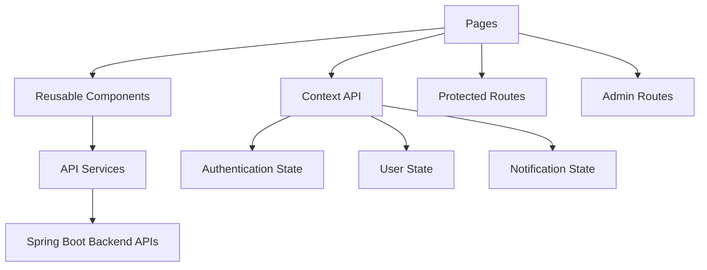
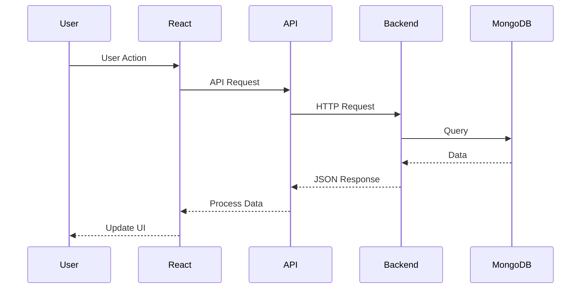

# 🎨 Phase 3 – Frontend Development

<p align="center">
  <b>Building a modern, responsive, and user-friendly UI using React & TypeScript</b>
</p>

---

## 🎯 Objective

Develop a **scalable, responsive, and interactive frontend** with secure authentication, modern UI/UX, and seamless backend integration.

---

## 🏗️ Frontend Architecture

The frontend follows a **component-based architecture** with centralized state management and API-driven communication.



---

## 📂 Frontend Structure

```text
src/
├── pages/
├── components/
├── services/
├── contexts/
├── hooks/
├── utils/
├── layouts/
├── assets/
└── types/
```

---

## 🎨 Key Features

- 🔐 JWT Authentication
- 📧 Email Verification Flow
- 🔑 Password Reset Flow
- 👤 User Profile Management
- 📰 News Feed Interface
- 🤖 AI Assistant Chat UI
- 📝 Notes Management
- 📄 PDF Export
- 🖼️ JPG Export
- 🔔 Real-Time Notifications
- 📊 Analytics Dashboard
- 🕘 Prediction History
- ⚙️ Settings Management
- 🛡️ Role-Based UI Access
- 📱 Fully Responsive Design

---

## 🔄 Frontend Request Flow



---

## 🚀 UI/UX Highlights

- Modern Dashboard
- Responsive Layout
- Dark Mode Support
- Loading Skeletons
- Toast Notifications
- Error Boundaries
- Optimistic UI Updates
- Accessible Components
- Smooth Animations
- Mobile-First Design

---

## 🔌 External Integrations

- Spring Boot REST APIs
- MongoDB-backed Data
- Hugging Face AI APIs
- NewsAPI
- ML Prediction Service
- Email Verification Service
- Notification Service