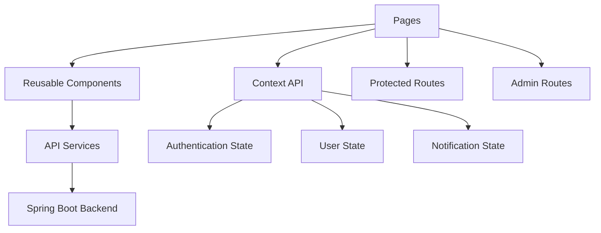
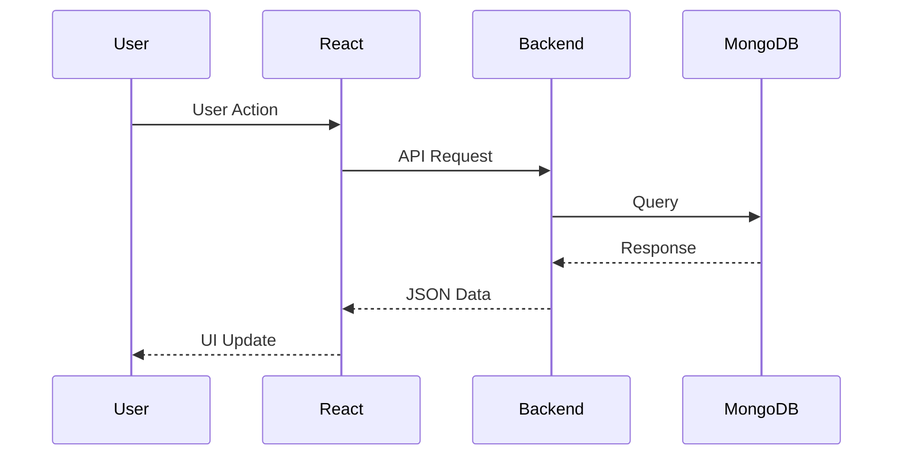

# 🎨 Phase 3 – Frontend Development

<p align="center">
  <b>Building a modern, responsive, and interactive user experience using React, TypeScript, and Tailwind CSS</b>
</p>

---

# 🎯 Goal

Develop a scalable frontend application that provides seamless interaction with AI-powered news analysis services while maintaining excellent user experience and responsive design.

---

# 🏗️ Frontend Architecture

The frontend follows a component-driven architecture with centralized state management and API-based communication.



---

# 📂 Project Structure

```text
src/
├── pages/
├── components/
├── services/
├── contexts/
├── hooks/
├── layouts/
├── utils/
├── assets/
└── types/
```

---

# 🎨 Core User Interfaces

## Authentication Module

- User Registration
- User Login
- Forgot Password
- Reset Password
- Email Verification
- Protected Routes

---

## Dashboard Module

- User Dashboard
- Prediction Statistics
- Activity Overview
- Analytics Visualization

---

## AI News Intelligence Module

### Fake News Detection

- Text Analysis
- URL Verification
- Confidence Scores
- Prediction Results

### Sentiment Analysis

- Positive Classification
- Neutral Classification
- Negative Classification

### Fact Checking

- Content Verification
- AI-Assisted Validation

---

## AI Chat Assistant

- Interactive Chat Interface
- User Guidance
- Prediction Assistance

---

## Notes Management

- Create Notes
- Edit Notes
- Delete Notes
- Organize Personal Information

---

## History Management

- Prediction History
- Analysis Records
- User Activity Tracking

---

## Notification Center

- Real-Time Notifications
- WebSocket Updates
- User Alerts

---

# 🔐 Authentication Flow

```text
User Login
    │
    ▼
JWT Token Issued
    │
    ▼
Stored Securely
    │
    ▼
Protected Route Access
```

---

# 🔄 Frontend Request Flow



---

# 🎯 UI/UX Highlights

- Responsive Design
- Mobile-Friendly Layout
- Reusable Components
- Clean Dashboard Interface
- Form Validation
- Loading States
- Toast Notifications
- Consistent Design System
- User-Friendly Navigation

---

# ⚡ State Management

## Context API

Used for:

- Authentication State
- User Information
- Notification Management
- Global Application State

---

# 🌐 API Integration

Frontend communicates with:

### Spring Boot Backend

- Authentication APIs
- Prediction APIs
- Analytics APIs
- User APIs
- Notes APIs

### Flask ML Service (via Backend)

- Fake News Detection
- Content Analysis

### External AI Services

- Hugging Face APIs
- NewsAPI

---

# 🛠️ Technology Stack

## Core Technologies

- React
- TypeScript
- Vite

## Styling

- Tailwind CSS

## Networking

- Axios

## Routing

- React Router DOM

## State Management

- Context API

---

# 📱 Responsiveness

Supported Devices:

- Desktop
- Laptop
- Tablet
- Mobile

---

# 🚀 Performance Optimizations

- Component Reusability
- Lazy Loading
- API Abstraction Layer
- Centralized Error Handling
- Efficient State Updates

---

# 🧪 Frontend Testing Checklist

- Authentication Flow
- Route Protection
- API Integration
- Form Validation
- Responsive Layout
- Error Handling

---

# ✅ Phase 3 Deliverables

- React Frontend Developed
- Authentication UI Completed
- Dashboard Interfaces Built
- AI Analysis Screens Implemented
- Notes Management Added
- Real-Time Notifications Integrated
- Responsive Design Completed
- Backend Integration Completed

---

## 📊 Phase Status

**Status:** ✅ Completed

**Technology Stack:** React • TypeScript • Vite • Tailwind CSS • Axios • Context API