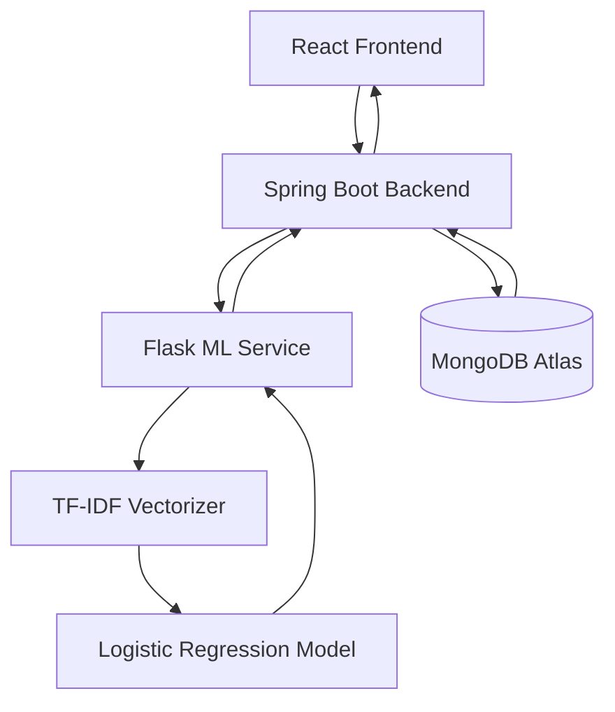
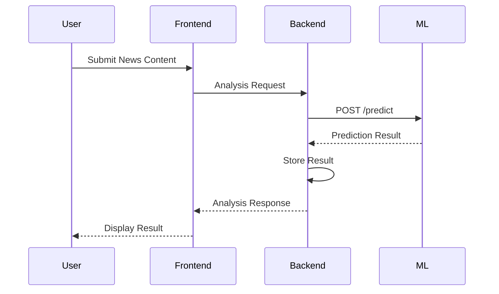

# 🔗 Phase 5 – ML Service Integration

<p align="center">
  <b>Integrating the Machine Learning engine with the backend to enable real-time AI-powered news analysis</b>
</p>

---

# 🎯 Goal

Connect the Flask-based Machine Learning service with the Spring Boot backend to provide real-time fake news detection, confidence scoring, and intelligent content analysis.

---

# 🏗️ Integration Architecture



---

# 🐍 Flask ML Microservice

The Machine Learning model is deployed as an independent Flask service responsible for processing prediction requests.

## Responsibilities

- Load trained ML model
- Load TF-IDF vectorizer
- Process incoming text
- Generate predictions
- Return confidence scores
- Handle inference requests

---

# 📡 API Endpoints

## Fake News Detection

```http
POST /predict
```

### Request

```json
{
  "text": "Breaking news article content..."
}
```

### Response

```json
{
  "prediction": "FAKE",
  "confidence": 0.94
}
```

---

## Health Check

```http
GET /health
```

### Response

```json
{
  "status": "UP"
}
```

---

# 🔄 Request Lifecycle



---

# 🧠 Prediction Flow

```text
Input Text
    │
    ▼
Preprocessing
    │
    ▼
TF-IDF Vectorization
    │
    ▼
Logistic Regression
    │
    ▼
Prediction
    │
    ▼
Confidence Score
```

---

# ⚙️ Spring Boot Integration

Backend communicates with the ML service using REST APIs.

## Integration Responsibilities

- Send prediction requests
- Receive model results
- Store prediction history
- Return processed response to frontend
- Handle ML service failures gracefully

---

# 💾 Prediction Persistence

Each prediction is stored in MongoDB for analytics and history tracking.

## Stored Information

```json
{
  "userId": "...",
  "inputText": "...",
  "prediction": "FAKE",
  "confidence": 0.94,
  "createdAt": "timestamp"
}
```

---

# 🛡️ Reliability Features

## Error Handling

- ML Service Unavailable Handling
- Timeout Protection
- Validation Checks
- Exception Logging

---

## Performance Optimizations

- Model Loaded Once at Startup
- Lightweight REST Communication
- Fast Inference Pipeline
- Efficient JSON Responses

---

# 🔧 Configuration

Backend Environment Variable:

```env
ML_SERVICE_URL=http://localhost:5000
```

Flask Service Default Port:

```env
PORT=5000
```

---

# 🧪 Integration Testing

### Verified Scenarios

- Backend ↔ ML Connectivity
- Prediction Accuracy Validation
- Response Serialization
- Error Handling
- MongoDB Persistence
- End-to-End Prediction Flow

---

# 🚀 Benefits of Separate ML Service

- Independent Deployment
- Easier Model Updates
- Technology Flexibility
- Better Scalability
- Clean Separation of Concerns

---

# ✅ Phase 5 Deliverables

- Flask ML API Developed
- Prediction Endpoint Exposed
- Spring Boot Integration Completed
- Prediction History Storage Added
- Confidence Score Support Implemented
- Error Handling Configured
- End-to-End Communication Validated

---

## 📊 Phase Status

**Status:** ✅ Completed

**Technology Stack:** Flask • Scikit-Learn • Spring Boot • REST APIs • MongoDB Atlas