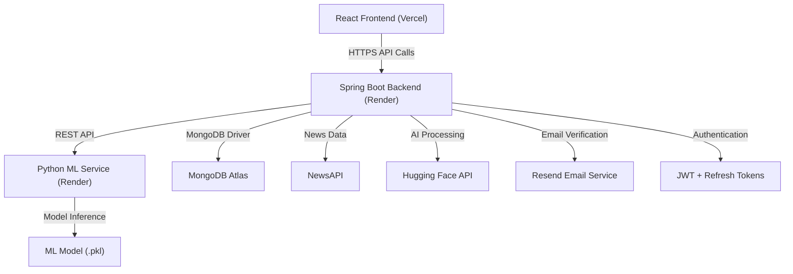

# 🚀 Phase 6 – Deployment & Production Readiness

  <b>Transforming TrueLens into a scalable, secure, and production-ready AI-powered platform</b>

---

## 🎯 Objective

Prepare the application for **real-world deployment** by improving performance, strengthening security, optimizing scalability, and delivering a seamless user experience.

---

## 🎨 Frontend Enhancements

- 📱 Fully Responsive Design (Mobile / Tablet / Desktop)
- 📊 Interactive Analytics Dashboards
- 🧭 Improved Navigation & User Experience
- ⚠️ User-Friendly Error Handling
- ⏳ Skeleton Loading States
- 🔔 Real-Time Notifications
- 🌙 Dark Mode Support
- 📝 Notes Export (PDF & JPG)
- 🤖 Enhanced AI Assistant Interface

---

## ⚙️ Backend Optimization

- ⚠️ Centralized Exception Handling (`GlobalExceptionHandler`)
- 🔐 JWT Authentication (Access + Refresh Tokens)
- 📧 Email Verification Workflow
- 🔑 Forgot Password & Password Reset
- 🚫 Secure Logout with Token Blacklisting
- 🔄 Refresh Token Management
- ⚡ Optimized REST APIs
- 📊 Analytics & Monitoring APIs
- 🔔 Notification Management APIs

---

## 🔐 Security Enhancements

- 👤 Role-Based Access Control (Admin / User)
- 🔒 Secured API Endpoints
- 🛡️ JWT Validation & Request Filtering
- 🔑 Protected Frontend Routes
- 🚫 Token Blacklisting
- ⚡ Rate Limiting
- 🧱 XSS Protection Ready
- 🧱 CSRF Protection Ready
- 🛡️ Input Validation & Sanitization
- 🔍 Audit Logging

---

## 📊 Advanced Features

- 📈 Admin Analytics Dashboard
- 📊 Prediction Analytics
- 😊 Sentiment Analysis Insights
- 🕘 Prediction History Tracking
- 🔔 Real-Time Notification System
- 📧 Email Verification & Password Recovery
- 🤖 AI-Powered News Analysis
- 📝 Notes Management with Export Support

---

## ☁️ Deployment Architecture

---

## 🚀 Deployment Stack

| Layer | Technology |
|---------|------------|
| Frontend | Vercel |
| Backend | Render |
| ML Service | Render |
| Database | MongoDB Atlas |
| Authentication | JWT + Refresh Tokens |
| Email Service | Resend |
| AI Integration | Hugging Face API |
| News Source | NewsAPI |

---

## ✅ Production Readiness Checklist

### Infrastructure

- ✅ MongoDB Atlas Connected
- ✅ Environment Variables Configured
- ✅ Production Build Verified
- ✅ Deployment Configurations Tested

### Security

- ✅ JWT Authentication Enabled
- ✅ Refresh Tokens Enabled
- ✅ Email Verification Enabled
- ✅ Token Blacklisting Enabled
- ✅ Protected Routes Configured

### Backend

- ✅ REST APIs Tested
- ✅ Error Handling Implemented
- ✅ Input Validation Added
- ✅ Analytics APIs Working

### Frontend

- ✅ Responsive UI
- ✅ Error States
- ✅ Loading States
- ✅ Protected Routes
- ✅ Dashboard Integration

### Database

- ✅ MongoDB Migration Completed
- ✅ Collections Indexed
- ✅ Refresh Tokens Stored
- ✅ Verification Tokens Stored
- ✅ Notifications Collection Added

---

## 📸 Screenshots

> Add application screenshots below to showcase UI and features.

### 🔐 Authentication

### 📧 Email Verification

### 🏠 Dashboard

### 🤖 AI Assistant

### 📰 Fake News Detection

### 📊 Analytics

### 🔔 Notifications

### 📝 Notes Management

---

## 🎯 Future Enhancements

- 🚀 GPT-5.5 / Gemini Integration
- 🔍 Advanced RAG-Based AI Assistant
- 📱 Progressive Web App (PWA)
- 🌎 Multi-Language Support
- 📈 Real-Time Monitoring Dashboard
- 🔔 Push Notifications
- 🧠 AI-Powered News Recommendations