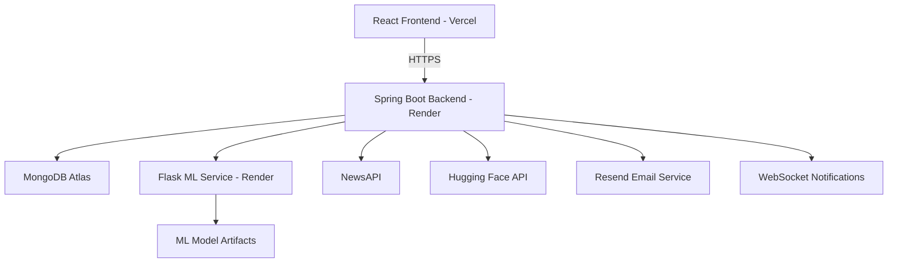

# 🚀 Phase 6 – Deployment & Production Readiness

<p align="center">
  <b>Preparing TrueLens for real-world deployment with security, scalability, reliability, and cloud infrastructure</b>
</p>

---

# 🎯 Goal

Transform TrueLens from a development project into a production-ready AI-powered platform by improving deployment architecture, security, monitoring, performance, and user experience.

---

# 🌐 Production Architecture



---

# 🎨 Frontend Production Enhancements

## User Experience

- Responsive Design
- Mobile Optimization
- Interactive Dashboards
- Improved Navigation
- User-Friendly Error States
- Loading Indicators
- Toast Notifications
- Real-Time Updates

---

## Application Features

- AI News Analysis Interface
- Prediction History Dashboard
- Analytics Dashboard
- Notification Center
- AI Chat Assistant
- Notes Management
- Authentication Flows

---

# ⚙️ Backend Production Enhancements

## Reliability

- Global Exception Handling
- Centralized Error Responses
- Request Validation
- Service Layer Abstraction
- API Documentation

---

## Authentication

- JWT Authentication
- Refresh Token Rotation
- Secure Logout
- Role-Based Authorization
- Email Verification
- Password Reset Workflow

---

## Performance

- Optimized REST APIs
- Efficient MongoDB Queries
- Stateless Authentication
- Lightweight ML Integration

---

# 🔐 Security Hardening

## Authentication Security

- JWT Validation
- Refresh Token Management
- Protected Routes
- Role-Based Access Control

---

## API Security

- Request Validation
- Input Sanitization
- Exception Handling
- Rate Limiting (Bucket4j)
- Secure Password Hashing (BCrypt)

---

## User Security

- Email Verification
- Password Recovery
- Token Expiration
- Secure Session Management

---

# 📊 Advanced Platform Features

## Analytics

- User Analytics
- Prediction Statistics
- Sentiment Insights
- Platform Metrics

---

## AI Capabilities

- Fake News Detection
- Sentiment Analysis
- Fact Checking
- AI Chat Assistant

---

## Real-Time Features

- WebSocket Notifications
- Live Updates
- Event-Based Messaging

---

# ☁️ Cloud Infrastructure

| Layer | Technology |
|---------|------------|
| Frontend | Vercel |
| Backend | Render |
| ML Service | Render |
| Database | MongoDB Atlas |
| Authentication | JWT |
| Email Service | Resend |
| AI APIs | Hugging Face |
| News APIs | NewsAPI |

---

# 🌍 Deployment Workflow

```text
Developer
     │
     ▼
GitHub Repository
     │
     ▼
Vercel Deployment
     │
     ▼
Frontend Hosting

Developer
     │
     ▼
GitHub Repository
     │
     ▼
Render Deployment
     │
     ▼
Spring Boot Backend

Backend
     │
     ▼
MongoDB Atlas
     │
     ▼
Persistent Storage
```

---

# 📖 Production Configuration

## Environment Variables

### Backend

```env
MONGODB_URI=

JWT_SECRET=

NEWS_API_KEY=

HUGGINGFACE_API_KEY=

RESEND_API_KEY=

ML_SERVICE_URL=
```

---

### Frontend

```env
VITE_API_BASE_URL=
```

---

# 🧪 Production Validation

## Backend Validation

- Authentication Tested
- Authorization Tested
- API Endpoints Verified
- Exception Handling Verified
- ML Integration Verified

---

## Frontend Validation

- Responsive Layout Tested
- Authentication Flow Tested
- Protected Routes Verified
- API Integration Verified
- Notification System Tested

---

## Infrastructure Validation

- MongoDB Atlas Connected
- Render Deployment Successful
- Vercel Deployment Successful
- Environment Variables Configured

---

# 📈 Production Readiness Checklist

## Infrastructure

- ✅ Cloud Deployment Completed
- ✅ Environment Variables Configured
- ✅ MongoDB Atlas Connected
- ✅ Production Builds Verified

### Security

- ✅ JWT Authentication
- ✅ Refresh Tokens
- ✅ Role-Based Access Control
- ✅ Password Reset Workflow
- ✅ Email Verification

### Backend

- ✅ REST APIs Operational
- ✅ Swagger Documentation Available
- ✅ Error Handling Implemented
- ✅ ML Integration Working

### Frontend

- ✅ Responsive UI
- ✅ Protected Routes
- ✅ Dashboard Functionality
- ✅ Real-Time Notifications

---

# 📸 Application Showcase

> Add screenshots demonstrating major platform features.

- Authentication
- Dashboard
- Fake News Detection
- Analytics
- AI Chat Assistant
- Notifications
- Notes Management
- Prediction History

---

# 🔮 Future Roadmap

- Advanced Transformer Models (BERT/RoBERTa)
- RAG-Based AI Assistant
- Progressive Web App (PWA)
- Multi-Language Support
- Real-Time Monitoring Dashboard
- Push Notifications
- Personalized News Recommendations

---

# ✅ Phase 6 Deliverables

- Production Deployment Completed
- Cloud Infrastructure Configured
- Security Hardening Applied
- ML Service Hosted
- Frontend Hosted
- Backend Hosted
- MongoDB Atlas Integrated
- Real-Time Features Enabled

---

## 📊 Phase Status

**Status:** ✅ Completed

**Deployment Stack:** Vercel • Render • MongoDB Atlas • Flask • Spring Boot • React