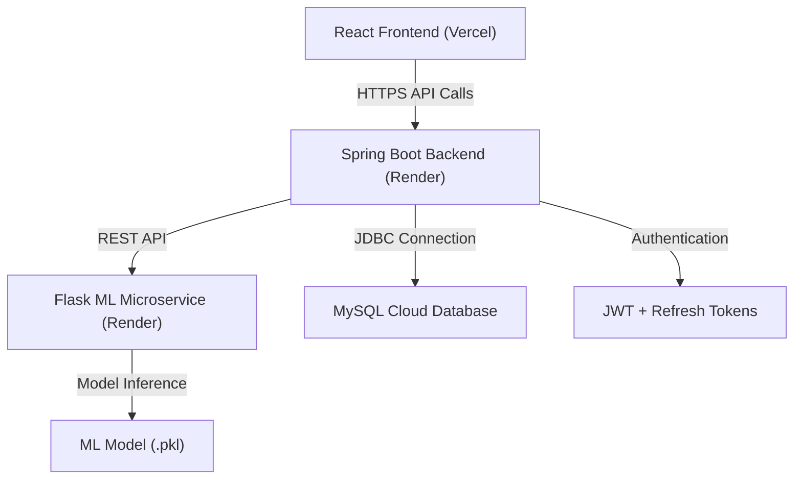

# 🚀 Phase 6 – Deployment & Final Polish

  <b>Transforming the application into a production-ready, scalable, and secure platform</b>

---

## 🎯 Objective

Prepare the application for **real-world deployment** by enhancing performance, strengthening security, and delivering a seamless user experience.

---

## 🎨 Frontend Enhancements

* 📱 Fully responsive design across mobile, tablet, and desktop
* 📊 Interactive dashboards with dynamic data visualization
* 🧭 Intuitive navigation and improved user flow
* ⚠️ Graceful error handling with user-friendly messages
* ⏳ Loading states and skeleton screens for better UX

---

## ⚙️ Backend Optimization

* ⚠️ Centralized exception handling using `GlobalExceptionHandler`
* 🔐 JWT-based authentication & authorization system
* 🚫 Secure logout with token blacklisting
* 🔄 Refresh token mechanism for session persistence
* ⚡ Optimized REST APIs for performance and scalability

---

## 🔐 Security Enhancements

* 👤 Role-based access control (Admin / User)
* 🔒 Secured API endpoints with authentication middleware
* 🛡️ Request filtering and token validation
* 🔑 Protected routes on both frontend and backend
* 🧱 Basic protection against common vulnerabilities (CSRF, XSS-ready structure)

---

## 📊 Advanced Features

* 📈 Admin analytics dashboard with key metrics
* 📊 Real-time prediction statistics visualization
* 😊 Sentiment analysis insights dashboard
* 📉 Data-driven insights for improved decision-making

---

## ☁️ Deployment Architecture

---

## 🚀 Deployment Stack

* **Frontend:** Vercel
* **Backend:** Render (Spring Boot)
* **ML Service:** Render (Flask API)
* **Database:** MySQL (Railway / PlanetScale / Aiven)
* **Authentication:** JWT (Access + Refresh Tokens)

---

## ✅ Production Readiness Checklist

* ✅ Environment variables secured
* ✅ CORS configured properly
* ✅ API endpoints tested in production
* ✅ Database connected and migrated
* ✅ Error logging enabled
* ✅ Build & deployment pipelines verified

---

## 📸 Screenshots

> Add your application screenshots below to showcase UI and features

### 🔐 Authentication

### 🏠 Dashboard

### 📊 Analytics

### 🤖 AI / Prediction

### 😊 Sentiment Analysis

---

## 📝 Notes

* Create a `screenshots/` folder in your repo root
* Add images with the same names as above or update paths accordingly
* Use high-quality images (recommended width: 1200px+)

